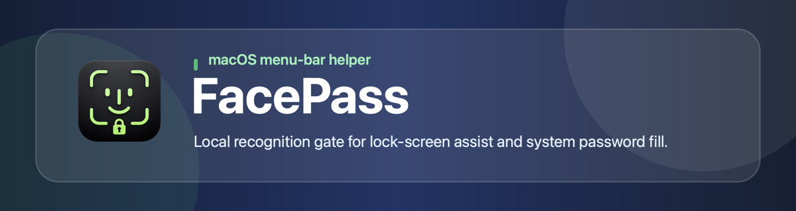
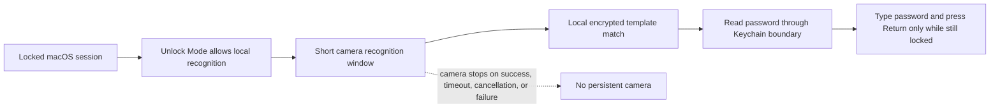
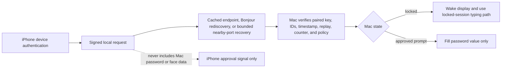
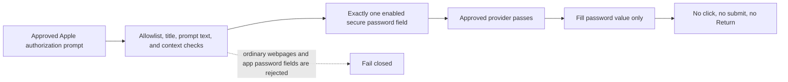

# FacePass



FacePass is a native macOS menu-bar helper for people who want a quick local unlock and password-fill workflow on their own Mac.

It is inspired by the idea of BLEUnlock, but it does not use BLEUnlock code. FacePass uses a local camera-based recognition gate instead of Bluetooth proximity.

[Official Website](https://facepass.robertw.me)

[中文说明](README.zh-CN.md)

## What It Does

FacePass currently supports three narrow targets and configurable provider routing:

- Lock-screen assist: when enabled, FacePass can run local face recognition, type your saved password, and press Return only while macOS is locked.
- Administrator/System Settings prompts: FacePass can detect approved macOS authorization password prompts, run local face recognition, and fill only the password value.
- Apple Passwords app unlock prompts: FacePass can detect the narrow approved Apple Passwords unlock prompt, use the normal approved provider path, and fill only the password value.

For unlocked prompts, including administrator/System Settings prompts and Apple Passwords app unlock prompts, FacePass does not click `Unlock`, `OK`, `Continue`, `Modify Settings`, `Login`, or any other confirmation button. It does not press Return or submit the prompt.

For the lock screen, you can enable local recognition unlock, iPhone StandBy Unlock, or both. The Unlock Mode settings can also route lock-screen unlock to local recognition while allowing the paired iPhone to fill approved unlocked prompts. iPhone StandBy Unlock is a separate provider. It is not a supplement to Mac local recognition and does not use the Mac camera.

## Visual Overview

The diagrams below summarize the current FacePass request flow. They are not Apple Face ID, Touch ID, or a replacement for macOS authentication.







## What It Is Not

FacePass is not Apple Face ID, Touch ID, or a replacement for macOS authentication.

FacePass does not support ordinary website or app password fields. It is intentionally scoped to the macOS lock screen, approved macOS administrator/System Settings authorization prompts, and the narrow Apple Passwords app unlock prompt.

Generic LocalAuthentication prompts remain rejected. Apple Passwords support requires strong Apple Passwords context, not just a generic sign-in prompt.

## Current Features

- Native macOS 13+ Swift/SwiftUI menu-bar app
- Settings window with setup, automation, unlock mode, iPhone pairing, recognition, and status sections
- Keychain-backed password storage
- First-run setup flow for Camera and Accessibility permissions
- Short-lived camera sessions for local recognition
- Single local enrollment template with multiple local embeddings
- User-adjustable recognition similarity threshold, defaulting to the recommended local prototype value
- Lock-screen assist with opt-in recognition gate
- Independent iPhone StandBy Unlock provider over local HTTP/Bonjour
- Administrator/System Settings and Apple Passwords prompt detection with value-only fill
- Automation conditions for automatic actions:
  - Wi-Fi connected
  - External monitor connected
  - Power state
  - Any/All selected condition matching


## Setup

1. Build and run FacePass.
2. Open the menu-bar app and complete setup.
3. Grant Camera permission.
4. Grant Accessibility permission.
5. Save your Mac login password in the Password section. FacePass stores it in Keychain, shows only whether a password record is configured, and does not reveal the value or length. A Keychain availability/readiness indicator means storage can be reached; it is not the saved-password indicator.
6. Capture enrollment samples in Recognition. FacePass auto-saves the encrypted local template after the required samples are captured; the Recognition status line reports the saved-template result, while the captured-samples count is only the current in-memory capture progress. Clear Saved Face removes the saved encrypted template.
7. Choose an Unlock Mode, then enable local recognition lock-screen assist, iPhone StandBy Unlock, or approved prompt handling as needed.

## iPhone StandBy Unlock

iPhone StandBy Unlock lets a paired iPhone request FacePass handling without running Mac local recognition. When the Mac is locked, a valid iPhone request can use the existing locked-session password typing path. When the Mac is unlocked and an approved prompt is present, including approved administrator/System Settings prompts or the Apple Passwords app unlock prompt, the selected Unlock Mode can allow the same signed iPhone approval to fill only the password value.

Flow:

1. You tap the FacePass unlock button from the iPhone companion's StandBy/Live Activity surface, optional WidgetKit widget, Shortcut, or app surface. The current widget extension exposes the Live Activity/Dynamic Island surface and an optional static widget using the same intent boundary.
2. `StandByUnlockIntent` requires local device authentication on the iPhone before any signed unlock request is sent.
3. The iPhone sends a signed `unlock_screen` request to the Mac over the local network.
4. The Mac verifies the paired public key, timestamp, replay cache, durable counter, iPhone device ID, Mac device ID, and action.
5. If FacePass is enabled, StandBy Unlock is enabled, the request is valid, and Unlock Mode allows the current flow, the Mac routes the request by current state. Locked sessions wake the display and use the existing lock-screen password typing plus Return path. Unlocked approved prompts, including administrator/System Settings prompts and the Apple Passwords app unlock prompt, receive value-only password fill with no click, submit, or Return.

The iPhone never receives the Mac password, face data, or local recognition result. The MVP keeps exactly one paired iPhone trust record at a time; pairing a different iPhone replaces the previous paired trust record. The Mac accepts only signed requests from the currently paired enabled iPhone and rejects expired, replayed, wrong-Mac, unpaired, disabled, provider-rejected, unsupported-state, missing-password, and other failure cases.

The local protocol scope is:

- `GET /v1/status`
- `POST /v1/pair`
- `POST /v1/standby-unlock`

Transport is local HTTP. The Mac prefers the fixed StandBy Unlock port `65531` and falls back only to a small bounded nearby-port range when that port is unavailable. Pairing QR codes include Bonjour metadata and, when the Mac can determine one, a LAN-reachable local HTTP endpoint so the iPhone can try direct `/v1/pair` first and fall back to Bonjour rediscovery if direct connection fails. After pairing, the iPhone uses the cached endpoint first; if that endpoint fails, it performs short Bonjour rediscovery and can probe a small bounded set of nearby ports on the cached host, validating `/v1/status` against the paired Mac ID and public-key fingerprint before sending any signed unlock request. It does not scan the full port range. After pairing, Settings hides the QR code and shows the paired iPhone status plus Pair iPhone, Forget iPhone, and Test Connection controls. The paired iPhone display name shown on the Mac comes from the iPhone companion's pairing registration `displayName` and is stored with the paired-device trust record in Keychain; it is not resolved through an external account service. FacePass does not use an external server, APNs, WebSocket transport, telemetry, cloud sync, or a paid service for StandBy Unlock.

The iOS companion under `Companion/iOS` now has a dedicated Xcode project at `Companion/iOS/FacePassCompanion.xcodeproj` with app, shared core, WidgetKit extension, and test targets: `FacePassCompanion`, `FacePassCompanionCore`, `FacePassCompanionWidgetExtension`, and `FacePassCompanionTests`. Its iOS deployment target is 17.0 for StandBy and `LiveActivityIntent` behavior.

The companion app includes QR camera pairing, manual pairing JSON fallback, paired Mac status, manual unlock request, forget pairing, and app-side Live Activity start/update. The shared core keeps a Keychain-backed long-lived iPhone device ID and signing-key baseline shared by the app and extension through the configured Keychain access group from processed Info.plist/entitlement values, durable per-Mac counters with OS file lock / cross-process coordination for app and extension increments, app-group UserDefaults endpoint cache, direct QR endpoint pairing when available, short Bonjour rediscovery fallback, `/v1/pair`, and signed `/v1/standby-unlock` client logic. The current WidgetKit extension exposes a Live Activity/Dynamic Island `FacePass Ready` card with an `Unlock Mac` AppIntent button that does not open the app when run, plus an optional static FacePass Unlock widget alongside that Live Activity using the same intent boundary. The extension also declares Local Network usage and `_facepass._tcp` Bonjour service access because the AppIntent can run there.

Current verification is limited: root `swift test` passes, the macOS app bundle verifies through `script/build_and_run.sh --verify`, and the iOS companion passes generic `iphoneos` `xcodebuild build` with signing disabled, simulator tests, and signed physical-device build/install on the paired iPhone. Manual verification is still required for QR camera scanning, Local Network prompt behavior, direct QR endpoint pairing, Bonjour rediscovery against the Mac including the WidgetKit extension declarations, `/v1/pair`, `/v1/standby-unlock`, the StandBy card/AppIntent, approved-prompt value fill from iPhone approval, and the actual Mac lock-screen unlock path.

## Privacy And Safety

FacePass keeps processing local.

- Passwords are stored only in macOS Keychain.
- FacePass does not store raw camera frames, photos, or screenshots.
- Camera sessions are short-lived and start only when needed.
- Face recognition templates are local encrypted template data, not raw images.
- FacePass does not upload passwords, face data, raw camera frames, unlock state, Wi-Fi details, display identifiers, or environment signals.
- FacePass has no analytics, telemetry, cloud sync, backend account service, external unlock server, APNs unlock path, WebSocket transport, or paid network service.
- StandBy Unlock stores paired iPhone public-key trust separately in Keychain, uses replay protection and a durable counter, and sends no Mac password or face data to the iPhone.

## Build From Source

Requirements:

- macOS 13+
- Xcode command line tools
- Swift 5.9+

Run tests:

```bash
swift test
```

Build and run the app:

```bash
./script/setup_and_run.sh
```

This prepares the ignored local recognition model artifact if it is missing or invalid, then builds, stages, and launches a physical app bundle at `dist/FacePass.app`. Use `./script/setup_and_run.sh --verify` to prepare the model and verify the app build without launching it. Verification fails if `dist/FacePass.app` is a symlink instead of a complete bundle. If FileProvider or iCloud metadata prevents strict codesign verification in `dist`, verification publishes and reports a physical fallback app at `~/Library/Caches/FacePass/dist/FacePass.app`. Use `./script/setup_and_run.sh --logs` to launch and stream FacePass logs.

The setup script may download the pinned AuraFace `glintr100.onnx`, verify it, run the legacy Core ML conversion path, and verify the generated bundled artifact at `Artifacts/Phase8/.../coreml-legacy/glintr100-legacy.mlmodel`. Model artifacts remain under ignored `Artifacts/` and are intentionally not committed to the repository. Model setup does not add app network behavior beyond the documented local StandBy Unlock HTTP/Bonjour transport and Sparkle appcast/package update checks. See [Recognition Model](docs/recognition-model.md) for details, including the advanced manual artifact helper.

## Distribution Status

FacePass remains buildable from source. The official public macOS release package is a Developer ID-signed and notarized DMG hosted on GitHub Releases, with Sparkle 2 update checks. The Sparkle feed URL is `https://facepass.robertw.me/updates/appcast.xml`; the appcast is hosted by the website under `/updates`, and DMG release packages are hosted on GitHub Releases. Sparkle is only an appcast/package download channel, not telemetry, a backend account service, cloud sync, or an unlock server.

Official user-facing DMG packages should come from the tag-triggered GitHub Actions release workflow after credentials and secrets are configured. `v*` tags and explicit `workflow_dispatch` runs are the formal release paths; ordinary pushes should not publish releases. Local packaging remains for dry-run and verification only.

Without an Apple Developer Program account, you can build and run locally, use ad-hoc signing, or use a local Apple Development certificate, but you cannot produce a Developer ID notarized app for trusted public direct download.

The iOS companion should use App Store distribution for public releases and TestFlight for beta testing. Ad Hoc, local development signing, enterprise distribution, and sideloading are not appropriate public distribution channels for the companion.

See [Distribution](docs/distribution.md) for details.

## Documentation

- [Static Website](website/)
- [Architecture](docs/architecture.md)
- [Security Model](docs/security-model.md)
- [Recognition Model](docs/recognition-model.md)
- [Authorization Prompt Detection](docs/prompt-detection.md)
- [Distribution](docs/distribution.md)
- [Development Roadmap](docs/roadmap.md)
- [Third-Party Notices](NOTICE.md)

## Roadmap

Next planned work:

1. Stronger face-recognition safety, including better liveness/spoof resistance so a photo is less likely to pass.
2. Better recognition calibration with local false-accept and false-reject testing.
3. Multi-role permissions, such as one enrolled face that can only unlock the lock screen and another role that can use all approved FacePass actions.
4. Packaging improvements for Developer ID-signed and notarized macOS DMG website distribution, Sparkle appcast publishing, GitHub Releases DMG packages, and App Store/TestFlight readiness for the iOS companion.

## License

FacePass is released under the MIT License. See [LICENSE](LICENSE).
