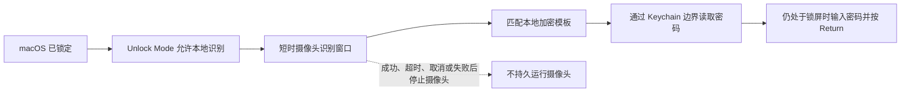
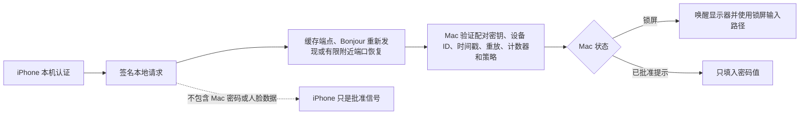
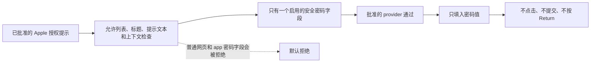

# FacePass


FacePass 是一个原生 macOS 菜单栏辅助工具，用于在你自己的 Mac 上做本地识别后的锁屏解锁辅助和系统授权密码填充。

它的产品想法受 BLEUnlock 启发，但没有使用 BLEUnlock 的代码。FacePass 不使用蓝牙距离判断，而是使用本地摄像头识别 gate。

[官方网站](https://facepass.robertw.me)

[English README](README.md)

## 它能做什么

FacePass 当前只支持三个狭窄目标，并提供可配置的 provider routing：

- 锁屏辅助：开启后，FacePass 可以在 macOS 已锁定时运行本地人脸识别，识别通过后输入已保存的密码并按 Return。
- 管理员/System Settings 授权提示：FacePass 可以检测被批准范围内的 macOS 授权密码提示，先运行本地人脸识别，然后只填入密码值。
- Apple Passwords app 解锁提示：FacePass 可以检测狭窄批准范围内的 Apple Passwords 解锁提示，经过正常的 approved provider path 后只填入密码值。

对于已解锁会话中的提示，包括管理员/System Settings 授权提示和 Apple Passwords app 解锁提示，FacePass 不会点击 `Unlock`、`OK`、`Continue`、`Modify Settings`、`Login` 或任何确认按钮，也不会按 Return 或提交表单。

锁屏场景中，你可以开启本地识别解锁、iPhone StandBy Unlock，或同时开启两者。Unlock Mode 设置也可以把锁屏解锁交给本地识别，同时允许已配对 iPhone 只处理被批准的已解锁提示密码填充。iPhone StandBy Unlock 是独立 provider，不是 Mac 本地识别的补充，也不使用 Mac 摄像头。

## 图示概览

下面的流程图概括当前 FacePass 请求链路。它们不是 Apple Face ID、Touch ID，也不是 macOS 系统认证替代品。







## 它不是什么

FacePass 不是 Apple Face ID、Touch ID，也不是 macOS 系统认证的替代品。

FacePass 不支持普通网页或普通 app 的密码输入框。当前范围只限 macOS 锁屏、被批准的 macOS 管理员/System Settings 授权提示，以及狭窄批准范围内的 Apple Passwords app 解锁提示。

普通 LocalAuthentication 提示仍然会被拒绝。Apple Passwords 支持要求有明确的 Apple Passwords context，不能只是普通 sign-in 提示。

## 当前功能

- 原生 macOS 13+ Swift/SwiftUI 菜单栏应用
- 设置窗口：设置、自动化、解锁模式、iPhone 配对、识别、状态
- 密码只存储在 macOS Keychain
- 首次启动设置流程：Camera 和 Accessibility 权限
- 短时间摄像头会话，只在需要识别时启动
- 单一本地 enrollment template，可包含多条本地 embedding
- 可调节 recognition similarity threshold，默认使用当前推荐值
- 可选锁屏解锁辅助
- 独立的 iPhone StandBy Unlock provider，使用本地 HTTP/Bonjour
- 管理员/System Settings 和 Apple Passwords 提示检测，以及只填密码值
- 自动操作条件：
  - Wi-Fi 已连接
  - 外接显示器已连接
  - 电源状态
  - 任意/全部条件匹配


## 设置方式

1. 构建并运行 FacePass。
2. 打开菜单栏应用并完成设置。
3. 授予 Camera 权限。
4. 授予 Accessibility 权限。
5. 在 Password 设置中保存你的 Mac 登录密码。FacePass 会把它存入 Keychain，只显示是否已有密码记录，不显示密码值或长度。Keychain 可用/就绪状态只表示存储可访问，不等于已经保存密码。
6. 在 Recognition 中采集 enrollment samples。采集到所需样本后 FacePass 会自动保存加密本地模板；Recognition 状态行会报告模板保存结果，captured samples 计数只表示当前内存中的采集进度。Clear Saved Face 会删除已保存的加密模板。
7. 选择 Unlock Mode，然后按需要开启本地识别锁屏辅助、iPhone StandBy Unlock，或 approved prompt 处理。

## iPhone StandBy Unlock

iPhone StandBy Unlock 允许已配对 iPhone 请求 FacePass 处理，不会运行 Mac 本地识别。Mac 锁屏时，有效 iPhone 请求可以使用现有锁屏密码输入路径。Mac 已解锁且当前存在被批准的提示时，包括被批准的管理员/System Settings 授权提示或 Apple Passwords app 解锁提示，所选 Unlock Mode 可以允许同一个签名 iPhone approval 只填入密码值。

流程：

1. 你在 iPhone companion 的 StandBy/Live Activity、可选 WidgetKit widget、Shortcut 或 app 界面点击 FacePass unlock 按钮。当前 widget extension 暴露 Live Activity/Dynamic Island 界面，也提供使用同一个 intent boundary 的可选 static widget。
2. `StandByUnlockIntent` 在发送任何签名 unlock request 之前，必须先要求 iPhone 上的 local device authentication。
3. iPhone 通过本地网络向 Mac 发送签名后的 `unlock_screen` 请求。
4. Mac 验证已配对 public key、timestamp、replay cache、durable counter、iPhone device ID、Mac device ID 和 action。
5. 当 FacePass 已开启、StandBy Unlock 已开启、request 有效，并且 Unlock Mode 允许当前流程时，Mac 会按当前状态路由请求。锁屏状态会唤醒显示器，并使用现有锁屏路径输入密码和按 Return；已解锁且存在被批准的提示时，包括管理员/System Settings 提示和 Apple Passwords app 解锁提示，只填密码值，不点击、不提交、不按 Return。

iPhone 永远不会收到 Mac 密码、人脸数据或本地识别结果。Mac 只接受来自已配对且启用的 iPhone 的签名请求，并会拒绝过期、重放、错误 Mac、未配对、已禁用、provider policy 拒绝、当前状态不支持、缺少密码以及其他失败情况。

本地协议范围是：

- `GET /v1/status`
- `POST /v1/pair`
- `POST /v1/standby-unlock`

传输只使用本地 HTTP。Pairing QR 会包含 Bonjour metadata，并在 Mac 能确定本地可达地址时包含 LAN local HTTP endpoint，让 iPhone 优先直连 `/v1/pair`，直连失败后再 fallback 到 Bonjour rediscovery。配对完成后，Settings 会隐藏 QR code，并显示已配对 iPhone 状态以及 Pair iPhone、Forget iPhone、Test Connection 三个控制按钮。Mac 上显示的已配对 iPhone 名称来自 iPhone companion 在 pairing registration 中发送的 `displayName`，并随 paired-device trust record 存入 Keychain；它不是通过外部账号服务解析出来的。StandBy Unlock 不使用外部服务器、APNs、WebSocket、telemetry、cloud sync 或付费服务。

`Companion/iOS` 下的 iOS companion 现在已有专用 Xcode project：`Companion/iOS/FacePassCompanion.xcodeproj`，并包含 app、shared core、WidgetKit extension 和 test targets：`FacePassCompanion`、`FacePassCompanionCore`、`FacePassCompanionWidgetExtension`、`FacePassCompanionTests`。iOS deployment target 是 17.0，用于 StandBy 和 `LiveActivityIntent` 行为。

iOS app 现在包含 QR 摄像头配对、手动 pairing JSON fallback、已配对 Mac 状态、手动 unlock request、forget pairing，以及 app 侧 Live Activity start/update。shared core 包含 Keychain-backed 长期 iPhone device id/signing key baseline；app 和 extension 通过 processed Info.plist/entitlements 中配置的 Keychain access group 共享这份 iPhone signing identity；per-Mac durable counter 使用 OS file lock / cross-process coordination 协调 app 和 extension 的递增；还包括 app-group UserDefaults endpoint cache、QR direct endpoint pairing（可用时）、短时间 Bonjour rediscovery fallback、`/v1/pair` client 和签名后的 `/v1/standby-unlock` client。当前 WidgetKit extension 暴露 Live Activity/Dynamic Island 的 `FacePass Ready` card 和 `Unlock Mac` AppIntent button，运行时不会打开 app；同时提供同一 intent boundary 下的可选 static FacePass Unlock widget，作为 Live Activity 旁边的附加界面。因为 AppIntent 可以在 extension 中运行，extension 也声明 Local Network 权限和 `_facepass._tcp` Bonjour service。

当前验证仍有限：根目录 `swift test` 通过，macOS app bundle 通过 `script/build_and_run.sh --verify`，iOS companion 通过了 signing disabled 的 generic `iphoneos` `xcodebuild build`、simulator tests，以及配对 iPhone 上的签名真机构建/安装。QR 摄像头、Local Network prompt、QR direct endpoint pairing、对 Mac 的 Bonjour rediscovery（包括 WidgetKit extension 声明）、`/v1/pair`、`/v1/standby-unlock`、StandBy card/AppIntent、iPhone approval 触发的授权提示只填值，以及真实 Mac 锁屏解锁路径仍需要真机手动验证。

## 隐私和安全

FacePass 的处理保持在本机。

- 密码只存储在 macOS Keychain。
- 不保存原始摄像头帧、照片或截图。
- 摄像头只在需要时短时间启动。
- 人脸识别模板是本地加密模板数据，不是原始图片。
- 不上传密码、人脸数据、原始摄像头帧、解锁状态、Wi-Fi 细节、显示器标识或环境信号。
- 没有 analytics、telemetry、cloud sync、后台账号服务、外部解锁服务器、APNs 解锁路径、WebSocket 或付费网络服务。
- StandBy Unlock 将已配对 iPhone public-key trust 单独存入 Keychain，使用 replay protection 和带 OS file lock / cross-process coordination 的 durable counter，并且不会把 Mac 密码或人脸数据发送到 iPhone。

## 从源码构建

要求：

- macOS 13+
- Xcode command line tools
- Swift 5.9+

运行测试：

```bash
swift test
```

构建并运行：

```bash
./script/setup_and_run.sh
```

这会在本地识别模型 artifact 缺失或无效时先准备它，然后构建、staging，并启动位于 `dist/FacePass.app` 的实体 app bundle。使用 `./script/setup_and_run.sh --verify` 可以准备模型并只验证 app 构建，不启动它。如果 `dist/FacePass.app` 是 symlink 而不是完整 bundle，验证会失败。如果 FileProvider 或 iCloud metadata 导致 `dist` 中的 strict codesign 验证失败，验证流程会发布并报告位于 `~/Library/Caches/FacePass/dist/FacePass.app` 的实体 fallback app。使用 `./script/setup_and_run.sh --logs` 可以启动并 stream FacePass logs。

setup 脚本可能会下载 pinned AuraFace `glintr100.onnx`，验证文件，运行 legacy Core ML 转换路径，并验证生成的 bundled artifact：`Artifacts/Phase8/.../coreml-legacy/glintr100-legacy.mlmodel`。模型 artifact 保留在已忽略的 `Artifacts/` 下，不会提交到仓库。模型设置不会给 app 增加超出已记录本地 StandBy Unlock HTTP/Bonjour 传输和 Sparkle appcast/package 更新检查之外的网络行为。手动 artifact helper 的高级用法见 [Recognition Model](docs/recognition-model.md)。

## 分发状态

FacePass 仍可从源码构建。macOS app 的正式公开发布包是托管在 GitHub Releases 上的 Developer ID 签名并 notarized 的 DMG，并使用 Sparkle 2 检查更新。Sparkle feed URL 是 `https://facepass.robertw.me/updates/appcast.xml`；appcast 由官网托管在 `/updates` 路径下，DMG release packages 托管在 GitHub Releases。Sparkle 只是 appcast/package download 通道，不是 telemetry、后台账号服务、cloud sync 或解锁服务器。

正式面向用户的 DMG package 应在配置好 credentials/secrets 后由 tag-triggered GitHub Actions release workflow 生成。`v*` tags 和显式 `workflow_dispatch` run 是正式 release 路径；普通 push 不应发布面向用户的 release。本地 packaging 只用于 dry-run 和验证。

没有 Apple Developer Program 账号时，你可以本地构建运行、ad-hoc 签名或使用本地 Apple Development 证书，但不能制作 Developer ID notarized 的可信公开下载版。

iOS companion 的公开发布应使用 App Store，beta 测试应使用 TestFlight。Ad Hoc、本地 development signing、enterprise distribution 和 sideloading 不适合作为 companion 的公开分发渠道。

详见 [Distribution](docs/distribution.md)。

## 文档

- [Architecture](docs/architecture.md)
- [Security Model](docs/security-model.md)
- [Recognition Model](docs/recognition-model.md)
- [Authorization Prompt Detection](docs/prompt-detection.md)
- [Distribution](docs/distribution.md)
- [Development Roadmap](docs/roadmap.md)
- [Third-Party Notices](NOTICE.md)

## 开发计划

下一步计划：

1. 更安全的人脸识别，包括更好的活体/防照片通过能力。
2. 更完整的本地 false accept / false reject 校准。
3. 多角色权限，例如某个已登记人脸只能解锁锁屏，另一个角色可以使用所有已批准的 FacePass 操作。
4. 改进 macOS Developer ID 签名、notarized DMG 网站分发、Sparkle appcast 发布、GitHub Releases DMG packages，并准备 iOS companion 的 App Store/TestFlight 发布。

## License

FacePass 使用 MIT License。见 [LICENSE](LICENSE)。
